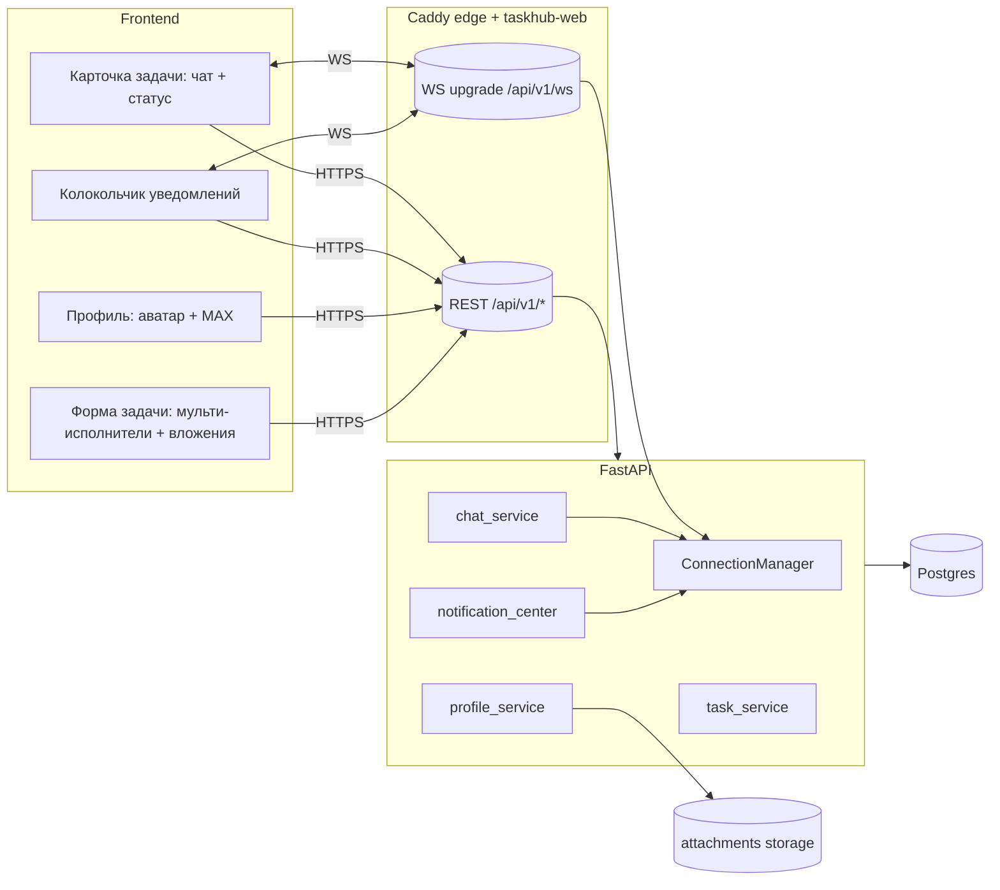

# Design — Task Collaboration & Profiles (№6, №7, №8)

## Принятые архитектурные решения (дефолты, можно поправить)

1. **Real-time:** WebSocket. Один эндпойнт `GET /api/v1/ws` (upgrade), авторизация по access-токену в query (`?token=`) — заголовки на WS из браузера задать нельзя. Caddy (внешний и внутренний) прозрачно проксирует WS-upgrade. Фоллбэк при обрыве — переподключение с экспоненциальной паузой + дозагрузка пропущенного через REST.
2. **Статусы:** `in_progress → under_review → done | rework`; `rework → under_review`; `* → cancelled` (кроме done); `done/cancelled → in_progress` (переоткрытие). «Готово к проверке» ставит исполнитель; «выполнено/на доработку» решает наблюдатель ИЛИ администратор.
3. **Мульти-исполнители:** таблица связей `task_assignees`; миграция переносит текущий `tasks.assignee_id` в неё, затем столбец удаляется.
4. **Аватары:** в существующем сторадже (`app/storage`), ключ — UUID, валидация типа (png/jpeg/webp) и размера (`MAX_AVATAR_MB`, дефолт 2). Отдаётся через `GET /api/v1/users/{id}/avatar`. Нет аватара — фронт рисует инициалы.
5. **Постановщик в ролях:** постановщик МОЖЕТ быть одним из исполнителей; запрет «наблюдатель ≠ исполнитель» и «наблюдатель ≠ постановщик» сохраняется (наблюдатель — независимый приёмщик).

---

## Overview

Изменения затрагивают доменный слой (роли, статус-машина, права), модель данных (4 новые
сущности/связи + поля профиля), транспорт (WebSocket для чата и уведомлений), хранилище (аватары),
API (мультипарт-создание задачи, чат, уведомления, профиль) и фронтенд (чат, колокольчик, профиль,
форма задачи с мульти-исполнителями и вложениями). Совместимость: миграции переносят существующие
задачи (один исполнитель → строка в `task_assignees`) без потери данных.



---

## Доменные изменения

### Роли (роль по задаче) — `domain/roles.py`
`role_of(user_id, *, author_id, assignee_ids, observer_ids) -> TaskRole`. ASSIGNEE — если `user_id ∈
assignee_ids`. Приоритет при пересечении: AUTHOR > ASSIGNEE > OBSERVER (постановщик-исполнитель
считается AUTHOR для прав на поля/статус, но получает уведомления как исполнитель — см. ниже).
Администратор не имеет роли по задаче, но получает доступ к просмотру/чату/приёмке через
override `is_admin` в сервисном слое (а не через таблицу прав).

### Статус-машина — `domain/status.py` + `enums.TaskStatus`
Новые значения enum (миграция PostgreSQL ENUM `ADD VALUE`): `under_review`, `rework`.
```
in_progress ─(submit)→ under_review ─(accept)→ done
   ↑  ↑                      │
   │  └────(reject)──────────┘  → rework ─(submit)→ under_review
   └─ rework, done, cancelled ─(reopen, author/admin)→ in_progress
   * (кроме done) ─(cancel, author/admin)→ cancelled
```
- `is_open(status)` = status ∉ {done, cancelled} (для просрочки/планировщика: under_review и rework — открытые).
- Переходы валидируются `validate_transition`; недопустимый → 409 STATUS_CONFLICT.

### Права — `domain/permissions.py` + новые `Action`
Новые действия: `SUBMIT_REVIEW` (assignee), `DECIDE_REVIEW` (observer; admin через override),
`POST_MESSAGE` (author, assignee, observer; admin через override). Удаляется/переосмысляется
`MARK_READY` (заменяется `SUBMIT_REVIEW`); `ADD_REPORT` сохраняется (исполнитель прикладывает
результаты), но «выполнено» исполнитель ставить не может (Req 5.4).

| Действие | Разрешено ролям | + admin override |
|---|---|---|
| VIEW / POST_MESSAGE / EXPORT | author, assignee, observer | да |
| EDIT_FIELDS / DELETE_TASK / cancel/reopen | author | да |
| SUBMIT_REVIEW | assignee | нет (только исполнитель) |
| DECIDE_REVIEW (done/rework) | observer | да |
| ADD_ATTACHMENT_TASK | author | да |

Авторизация остаётся единой через `authorize(action, role, is_admin=...)`.

---

## Модель данных (миграции Alembic)

Новая ревизия `0003_collaboration` (down_revision `0002_admin_handover`).

### `task_assignees` (Req 2)
```sql
CREATE TABLE task_assignees (
  task_id UUID NOT NULL REFERENCES tasks(id) ON DELETE CASCADE,
  user_id UUID NOT NULL REFERENCES users(id) ON DELETE RESTRICT,
  PRIMARY KEY (task_id, user_id)
);
CREATE INDEX ix_task_assignees_user ON task_assignees(user_id);
-- backfill из текущего одиночного исполнителя:
INSERT INTO task_assignees(task_id, user_id) SELECT id, assignee_id FROM tasks;
ALTER TABLE tasks DROP COLUMN assignee_id;
```
RESTRICT на `user_id` сохраняет текущую защиту (нельзя удалить пользователя с активными задачами;
логика `flag_foreign_for_reassignment` адаптируется на множественность). ≥1 исполнитель — инвариант
приложения (БД допускает 0, но сервис запрещает создать задачу без исполнителей).

### `task_messages` (Req 4)
```sql
CREATE TABLE task_messages (
  id UUID PRIMARY KEY DEFAULT gen_random_uuid(),
  task_id UUID NOT NULL REFERENCES tasks(id) ON DELETE CASCADE,
  author_id UUID NOT NULL REFERENCES users(id) ON DELETE RESTRICT,
  body TEXT NOT NULL,                 -- длина ≤ MAX_MESSAGE_LEN (дефолт 4000)
  created_at TIMESTAMPTZ NOT NULL DEFAULT now()
);
CREATE INDEX ix_task_messages_task ON task_messages(task_id, created_at);
```
`author_id` RESTRICT + снапшот имени не нужен (отображаем актуальные display_name/avatar; для
tombstone-пользователя — «Пользователь удалён»). Тело экранируется при рендере (React по умолчанию).

### `notifications` (Req 6)
```sql
CREATE TABLE notifications (
  id UUID PRIMARY KEY DEFAULT gen_random_uuid(),
  user_id UUID NOT NULL REFERENCES users(id) ON DELETE CASCADE,
  kind TEXT NOT NULL,                 -- 'chat_message' | 'task_rework'
  task_id UUID REFERENCES tasks(id) ON DELETE CASCADE,
  message_id UUID REFERENCES task_messages(id) ON DELETE CASCADE,
  text TEXT NOT NULL,
  is_read BOOLEAN NOT NULL DEFAULT false,
  created_at TIMESTAMPTZ NOT NULL DEFAULT now()
);
CREATE INDEX ix_notifications_user_unread ON notifications(user_id, is_read, created_at DESC);
```
On-site только — никаких записей в `notification_log`/e-mail по чату.

### `users` (Req 7, 8)
```sql
ALTER TABLE users ADD COLUMN avatar_path TEXT;          -- ключ в сторадже, NULL = заглушка
-- max_user_id уже существует; становится редактируемым самим пользователем
```

---

## Транспорт: WebSocket

- Эндпойнт `app/api/routers/ws.py`: `@router.websocket("/ws")`. Аутентификация: `token` из query →
  `decode_access_token` → `CurrentUser` (+ проверка реестра). При невалидном — close(1008).
- `app/realtime/manager.py: ConnectionManager` — `dict[user_id -> set[WebSocket]]`. Методы
  `connect/disconnect/send_to_users(ids, payload)`. In-process (один backend-контейнер — ок;
  при будущем масштабировании → Redis pub/sub, отмечено как задел).
- Сообщения сервер→клиент (JSON): `{type:"chat", taskId, message:{...}}`,
  `{type:"notification", notification:{...}}`, `{type:"task_status", taskId, status}`.
- Клиент шлёт только ping/keepalive; запись сообщений и смена статуса — через REST (надёжнее,
  переиспользует валидацию/права), а WS — канал доставки. Это упрощает консистентность.
- **Caddy:** reverse_proxy в обоих слоях апгрейд WS поддерживает из коробки; добавим в Caddyfile
  явный матч `/api/v1/ws` с увеличенными таймаутами (как у tagcloud). Деградация: если WS не
  поднялся, фронт продолжает работать на REST + поллинг каждые N секунд для чата/счётчика.

---

## API (новое/изменённое)

### №6 — создание задачи с вложениями
- `POST /tasks` переводится на `multipart/form-data`: текстовые поля (как сейчас, JSON-строкой в
  поле `payload`) + `files[]`. Сервис в ОДНОЙ транзакции создаёт задачу, исполнителей, наблюдателей и
  сохраняет вложения; файлы пишутся в сторадж, при ошибке транзакции — удаляются (компенсация), без
  «осиротевших» файлов и без частичной задачи (Req 1.2/1.5). Лимиты — те же (`MAX_FILE_SIZE_MB`,
  `MAX_FILES_PER_TASK`, `MAX_TASK_TOTAL_MB`), переиспользуется `attachment_service`.
- Альтернатива (отклонена): двухшаговый create+upload — даёт окно «задача без файлов»/осиротевшие
  файлы, противоречит Req 1.5.

### №7 — чат, статусы, уведомления
- `GET /tasks/{id}/messages?after=<cursor>` — история (пагинация по created_at/id).
- `POST /tasks/{id}/messages` `{body}` — отправка (право POST_MESSAGE). После коммита: рассылка по WS
  всем участникам + создание `notifications(kind=chat_message)` исполнителям (кроме автора сообщения,
  Req 6.6) + WS-пуш этих уведомлений.
- `POST /tasks/{id}/submit-review` — исполнитель → under_review.
- `POST /tasks/{id}/review` `{decision: "accept"|"rework"}` — наблюдатель/админ → done|rework; при
  rework: уведомления исполнителям (kind=task_rework) + WS.
- Существующие `change-status` (cancel/reopen author/admin), `report`, `attachments` сохраняются.
- `GET /notifications?unread=...` + `GET /notifications/unread-count`; `POST /notifications/read`
  `{ids?}` (пустой = все) — пометить прочитанными; открытие задачи помечает связанные прочитанными.

### №8 — профиль
- `GET /users/me` — профиль (email, display_name, is_admin, max_contact, hasAvatar).
- `PATCH /users/me` `{maxContact?, displayName?}` — самостоятельное редактирование (валидация MAX).
- `PUT /users/me/avatar` (multipart, одно изображение) / `DELETE /users/me/avatar`.
- `GET /users/{id}/avatar` — отдаёт картинку (для участников чата); 404→заглушка на фронте.
- №9 уже выполнено: MAX недоступен админу (исключён из RegistryCreate/UpdateIn).

---

## Фронтенд

- **Форма задачи** (`TaskForm`): `UserPicker` → мультивыбор исполнителей; вложения (переиспользовать
  существующий аплоадер) добавляются в форме и уходят мультипартом при создании.
- **Карточка задачи**: блок чата (лента + поле ввода, аватары авторов, live по WS, дозагрузка по REST),
  кнопки статуса по роли: исполнитель — «Готово к проверке»; наблюдатель/админ в `under_review` —
  «Принять»/«Вернуть на доработку»; постановщик/админ — отмена/переоткрытие.
- **Колокольчик** в `AppShell`: счётчик непрочитанных (WS + первичный REST), выпадающий список,
  переход к задаче, пометка прочитанным.
- **Профиль** (новый роут `/profile`): загрузка/удаление аватара, поле MAX, display_name.
- **Аватар-компонент** `Avatar` (картинка или инициалы) — в чате и колокольчике.
- `useRealtime()` — единый WS-хук: подключение с токеном, реконнект, маршрутизация сообщений в
  react-query кэш (инвалидация/`setQueryData` для чата, счётчика уведомлений).

---

## Согласование с просрочкой и планировщиком (Req 5.7)
`is_open` теперь включает `under_review`/`rework`, поэтому задача на проверке/доработке остаётся под
напоминаниями и расчётом просрочки до `done`/`cancelled`. `overdue_sweep` и presenter-логика
используют `is_open` вместо явного сравнения с `in_progress`. Письма планировщика (assigned/due/overdue)
не меняются; чат-уведомления — отдельный on-site канал, e-mail по ним не шлётся (Req 6.1).

---

## Безопасность
- WS-токен в query логируется? — нет: исключить query из логов WS, либо передавать токен первым
  сообщением после connect. Выберем «первое сообщение `auth`», чтобы токен не попал в логи/историю.
- Аватары: проверка MIME по содержимому (magic bytes), не только по расширению; отдача с
  `Content-Type` и `X-Content-Type-Options: nosniff` (уже глобально). Доступ к `/users/{id}/avatar` —
  только аутентифицированным.
- Чат-доступ строго по `get_task_context` (роль ≠ NONE) либо admin.
- Длина сообщения и базовая нормализация; рендер через React (без `dangerouslySetInnerHTML`).

---

## Correctness properties (для PBT на этапе реализации)
1. **Статус-машина замкнута:** для любой последовательности допустимых действий статус всегда ∈ enum,
   и недопустимый переход всегда даёт 409 (никогда не меняет статус).
2. **Только приёмщик закрывает:** не существует последовательности, где исполнитель (не являющийся
   наблюдателем/админом) переводит задачу в `done`.
3. **Идемпотентность прочтения:** повторная пометка уведомления прочитанным не меняет счётчик ниже 0 и
   не «воскрешает» непрочитанные.
4. **Уведомление автору не приходит:** автор сообщения никогда не получает notification по своему же
   сообщению.
5. **Атомарность создания с вложениями:** при сбое сохранения любого вложения не остаётся ни задачи,
   ни файлов в сторадже (нет частичного состояния).
6. **Мульти-исполнитель:** пользователь видит задачу во вкладке «Я исполнитель» ⟺ он ∈ task_assignees.
7. **Инвариант ролей:** наблюдатель не пересекается с исполнителями/постановщиком в любой валидной задаче.

---

## Тестирование
- Unit: роли (мультиисполнитель), статус-переходы, права (+admin override), формат уведомлений.
- Integration (реальный Postgres): мультипарт-создание с вложениями (успех/откат), чат (права/доставка
  записи в БД), submit→review→accept/rework, уведомления (создание/счётчик/прочтение/не-себе),
  профиль (MAX/аватар: загрузка/валидация/удаление), миграция backfill исполнителей.
- WS: интеграционный тест соединения/доставки через ASGI WebSocket client.
- Frontend: компоненты Avatar/Bell, useRealtime-роутинг (мок WS), TaskForm мультивыбор.

---

## Поэтапная реализация (превью для tasks.md)
1. Миграция + модели (task_assignees backfill, task_messages, notifications, users.avatar_path) и
   доменные правки (roles/status/enums/permissions).
2. Бэкенд №7-core: статус-переходы (submit/review), мульти-исполнитель в выборках и правах.
3. WebSocket-инфраструктура (manager, эндпойнт, Caddy) + чат (REST+WS) + уведомления.
4. №6: мультипарт-создание с вложениями (атомарно).
5. №8: профиль (PATCH/avatar) + раздача аватаров.
6. Фронтенд: форма (мультиисполнители+вложения), карточка (чат+статусы), колокольчик, профиль, Avatar, useRealtime.
7. Тесты (unit/integration/PBT/WS/frontend) + деплой (миграция, проброс WS в Caddy).
